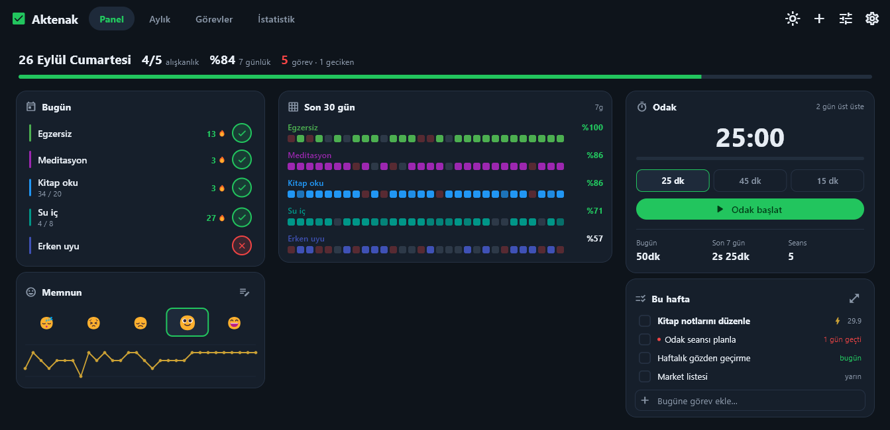

# Aktenak — Habit Tracker

Local-first, no-backend habit tracker. Built with Flutter (desktop-first: Windows + Linux).
See [BLUEPRINT.md](BLUEPRINT.md) for the original design rationale.

Dört modül + bunları tek ekranda birleştiren bir panel: **alışkanlıklar · mood · görevler ·
odak seansları**.



## İndir

**[En son sürümü indir →](https://github.com/tungarix/habit-tracker/releases/latest)**
(Windows, portable — kurulum gerektirmez, zip'i açıp `aktenak_habit_tracker.exe`'yi
çalıştırman yeterli.)

Uygulama imzasız olduğu için Windows SmartScreen bir uyarı gösterebilir ("Bilinmeyen
yayımcı"). Bu bilinen bir sınır — kod imzalama sertifikası şu an kapsam dışı. Devam etmek
için: **Ek bilgi → Yine de çalıştır**. Kaynağa güvenmek istemiyorsan kodun tamamı bu
repoda, MIT lisanslı — inceleyip kendin derleyebilirsin.

Sorun/öneri için [Issues](https://github.com/tungarix/habit-tracker/issues)
sekmesini kullanabilirsin.

## Özellikler (mevcut durum)

- **Panel** (açılış ekranı, günlük kullanımın çoğunu tek başına karşılar):
  - üstte tarih, `X/Y alışkanlık`, 7 günlük tamamlanma yüzdesi ve açık görev sayısı
  - bugünün alışkanlıkları — tek dokunuşla ✓ → ✗ → – → boş; sayılabilir olanlarda
    miktar girişi
  - her alışkanlık için **30 günlük ısı şeridi** (kendi renginin açık→koyu yoğunluğu;
    sayılabilir alışkanlıkta kısmi ilerleme de görünür) + 7 günlük yüzde
  - **odak sayacı** (pomodoro 25/45/15 dk) ve bugün / son 7 gün odak süresi
  - **bu hafta** görev bloğu + tek satırlık hızlı görev ekleme
  - mood seçimi ve 30 günlük mood çizgisi
  - genişliğe göre 3 / 2 / 1 sütuna iner
- **Görevler**: başlık, durum (yapılacak/yapılıyor/bitti), öncelik, tarih. Aciliyete göre
  gruplanır (geciken · bugün · yarın · bu hafta · sonra · tarihsiz).
- **Aylık**: klasik kağıt tracker grid'i — satırlar alışkanlıklar, sütunlar günler (1-31).
  Hücreye dokununca durum döner. Grid'in hemen altında aynı gün eksenine hizalı
  **mood çizgi grafiği**. Ay ileri/geri gezilebilir.
- **İstatistik**: genel kartlar + her alışkanlık için mevcut/en uzun seri, tamamlanma
  yüzdesi ve son 30 gün şeridi. Ayrıca mood ↔ tamamlama oranı korelasyon görünümü
  (mood başına ortalama tamamlama + Pearson r).
- **Alışkanlıklar**: oluştur / düzenle / arşivle / sil. Ad, açıklama, **tür**
  (yap-yapma / sayılabilir + günlük hedef), **kategori** (Beden/Konuşma/Zihin), renk,
  ikon ve planlı günler (boş = her gün).
- **Tema**: karanlık varsayılan, tek dokunuşla açık temaya geçiş (tercih kalıcı). Her iki
  temada da metin/durum renkleri WCAG AA kontrast eşiğini (4.5:1) geçer.
- **Sistem tepsisi** (Windows/Linux): pencereyi kapatmak uygulamayı kapatmaz, tepsiye
  küçültür — tepsi ipucu bugünkü `X/Y` durumunu gösterir, sağ tık menüsünden bugün için
  bekleyen alışkanlıkları tek tıkla ✓ işaretleyebilirsin. Tamamen çıkmak için menüdeki
  **Çıkış**.
- **Klavye kısayolları**: Ctrl+1..4 sekmeler arası geçiş, Ctrl+N alışkanlık ekler.
- **Yedek**: tüm veri tek `.json` dosyası (format v4: alışkanlıklar + işaretlemeler +
  mood + görevler + seanslar). v1/v2/v3 yedekler içe aktarılabilir. **Birleştir** veya
  **Tamamen değiştir** seçenekleri.

Veri tamamen yerel: drift (SQLite) ile cihazda saklanır. Sunucu, hesap, login yok.

## Kurallar (özet)

- Seri: planlı günlerde kesintisiz ✓; **– (atlandı) seriyi bozmaz**, ✗ ve boş geçmiş
  gün bozar; bugünün henüz işaretlenmemiş olması bozmaz.
- Tamamlanma oranı: ✓ / (planlı − atlanan).

## Mimari

Üç katman. **`core/` içinde tek bir GUI importu yoktur** — bu kural
`test/core_purity_test.dart` ile zorlanır. Amacı: mantık ve şema başka bir arayüze
(telefon) taşınırken olduğu gibi kalsın, sadece `features/` yeniden yazılsın.

```
lib/
  main.dart            # ProviderScope + locale init
  app.dart             # MaterialApp + üç sekmeli kabuk (Bugün/Aylık/İstatistik)
  core/                # SAF MANTIK — Flutter importu yok
    constants.dart     #   AppConstants, kWeekdayShort
    enums.dart         #   EntryStatus, HabitKind, TaskStatus, SessionKind, Mood…
    date_utils.dart    #   dayOf() — gün sınırının TEK kaynağı
    streak.dart        #   alışkanlık başına seri / tamamlanma
    stats.dart         #   günlük oran, heatmap, Pearson korelasyon
    tasks.dart         #   görev gruplama / sıralama / özet
    sessions.dart      #   odak süresi toplamları, süre biçimlendirme
  data/
    database/          # drift tabloları + AppDatabase (+ .g.dart), schema v4
    models/            # HabitTodayView
    repositories/      # habit_, task_, session_, backup_repository
    providers.dart     # Riverpod (tema, dayStartHour, todayProvider, özetler)
  features/            # ARAYÜZ — hesap yapmaz, core'u çağırır
    dashboard/ tasks/ home/ stats/ habits/ backup/
  shared/              # sunum ortakları
    theme.dart         #   AppColors (ThemeExtension) + AppTheme + kTabularNums
    habit_style.dart   #   renk/ikon paletleri
    habit_actions.dart #   işaretleme akışı (bool döngü / sayı girişi)
    widgets/           #   HabitAvatar, StreakBadge, StatusMark, CountEntryDialog
```

### Migration kuralı (önemli)

Her migration adımı **idempotent** olmalı: sütun/tablo eklemeden önce varlığı kontrol
edilir. Gerekçe gerçek bir arıza: uygulama yükseltme sırasında kapanınca DDL kalıcı oldu
ama sürüm numarası geri alındı; sonraki her açılış `duplicate column name` ile patladı ve
veritabanı kalıcı olarak kilitlendi. `test/migration_test.dart` bu senaryoyu tutuyor.

### Gün sınırı (önemli)

Bir izleme günü gece yarısında değil, **`day_start_hour`'da (varsayılan 04:00)** başlar.
Saat 01:35'te işaretlenen alışkanlık biten güne yazılır. Tüm tarih hesapları
`core/date_utils.dart`'taki `dayOf()` fonksiyonundan geçer; arayüz günü doğrudan değil
`todayProvider`'dan okur (uygulama gece açık kalırsa kendiliğinden döner).

### Alışkanlık türleri

- `kind='bool'` — tek dokunuş ✓/✗/–
- `kind='count'` — günlük `target`'a karşı sayı (ör. 10000 adım); `habit_entries.value`
  girilen miktarı tutar, hedefe ulaşınca gün ✓ sayılır.

Testler: `flutter test` → **72 test** (71 geçer, 1 gerçek yedek dosyası olmayan makinelerde
atlanır) — saf mantık (seri, istatistik, görev sıralama,
odak toplamları), gün sınırı, `core/` saflığı, migration (gerçek veri + yarım kalmış
yükseltme onarımı), panel düzeni üç kırılma noktasında, uçtan uca alışkanlık ekleme.

## Geliştirme

Gereksinimler: [Flutter SDK](https://docs.flutter.dev/get-started/install) (stable), Windows
masaüstü derlemesi için Visual Studio Build Tools + "Desktop development with C++" workload
(`flutter doctor` eksik olanı gösterir).

```powershell
flutter pub get
dart run build_runner build           # drift kod üretimi (tabloları değiştirince)
flutter analyze
flutter test
flutter run -d windows                # veya: flutter build windows --release
```
